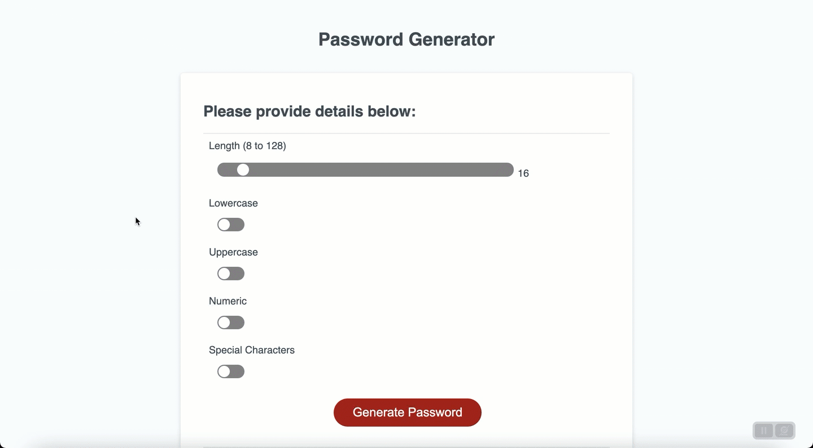
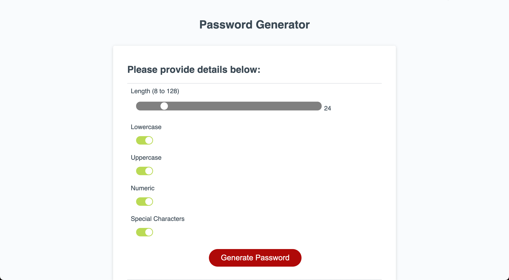
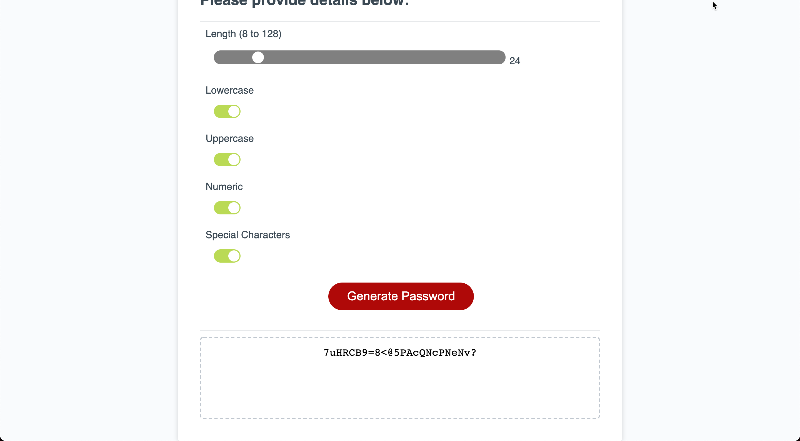
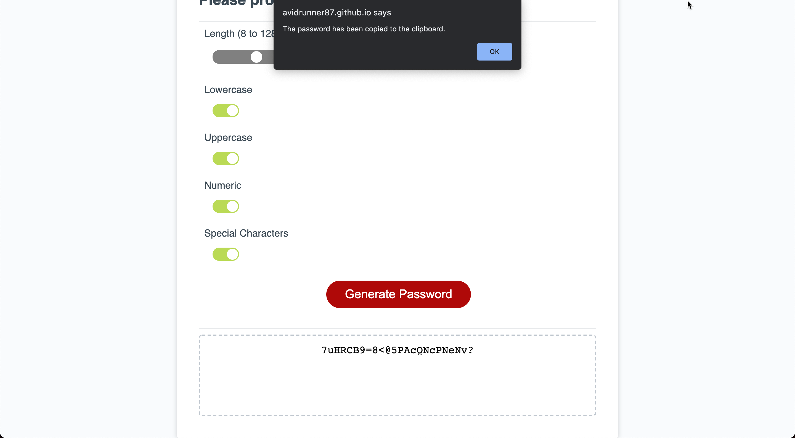

# Password Generator

## Description
Building a password generator application that takes in criteria from the user and runs dynamically on the webpage with no server-side code. This application is responsive to screen sizes and has been refactored to improve on the user experience and accessibility. 

## Usage
You can access the app here [https://avidrunner87.github.io/password-generator/](https://avidrunner87.github.io/password-generator/).

## User Story
**AS AN** employee with access to sensitive data 
I **WANT** to randomly generate a password that meets certain criteria 
**SO THAT** I can create a strong password that provides greater security

### Acceptance Criteria
**GIVEN** I need a new, secure password

>WHEN I click the button to generate a password 
THEN I am presented with a series of prompts for password criteria

>WHEN prompted for password criteria 
THEN I select which criteria to include in the password

>WHEN prompted for the length of the password 
THEN I choose a length of at least 8 characters and no more than 128 characters

>WHEN prompted for character types to include in the password 
THEN I choose lowercase, uppercase, numeric, and/or special characters

>WHEN I answer each prompt 
THEN my input should be validated and at least one character type should be selected

>WHEN all prompts are answered 
THEN a password is generated that matches the selected criteria

>WHEN the password is generated 
THEN the password is either displayed in an alert or written to the page

To improve on the usability of the application, the intention of the acceptance criteria was maintained, but the implementation was changed (e.g. form instead of window prompts).

## Licenses

## Technologies

## Mock-up
The following picture shows the website appearance and capabilities:

 

 

## Installation
To fork this code to further improve the website, please follow these directions:

1. In Github fork the repository.
1. Clone the repository to your local computer.

_This assumes that you have setup your own SSH keys to connect with Github._

## References
[MDN Web Docs](https://developer.mozilla.org/en-US/docs/Web/HTML/Element) 
[W3 Schools](https://www.w3schools.com/) 
[Codepen](https://codepen.io/mburnette/pen/LxNxNg)